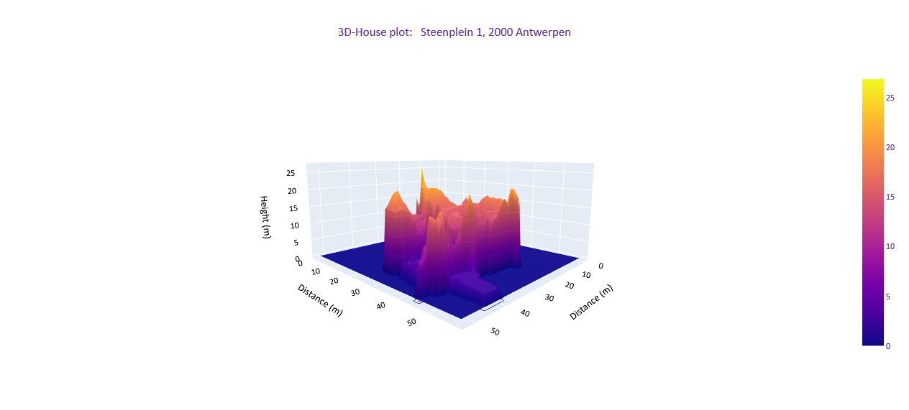

# challenge-3D-House

## The Mission
> We are _LIDAR PLANES_, active in the Geospatial industry. We would like to use our data to launch a new branch in the insurance business. So, we need you to build a solution with our data to model a house in 3D with only a home address.

## Mission objectives
Consolidate the knowledge in Python, specifically in :
- NumPy
- Pandas
- Matplotlib

## Installation 
- Create an virtual environment and install the necessary libraries:
  - rasterio
  - shapely
  - geopandas
  - rioxarray
  - plotly

## Process
- Create an virtual environment: House3D
- Install the necessary libraries:
  - rasterio
  - shapely
  - geopandas
  - rioxarray
  - plotly
- Require an address to the user:
  - Created a function that makes a request API: https://api.basisregisters.vlaanderen.be/v1/adresmatch.
  - Get the coordinates of the house and draw the polygon.
- Identified the area (raster) where the house is ubicated 
  - Create a BoundigBox dataframe with the bounds of the 43 rasters.
  - Finding the corresponding raster, through the function def get_area().
- Download the corresponding DSM and DTM tiff:
    - Through a request:
      - [DSM](http://www.geopunt.be/download?container=dhm-vlaanderen-ii-dsm-raster-1m&title=Digitaal%20Hoogtemodel%20Vlaanderen%20II,%20DSM,%20raster,%201m)
      - [DTM](http://www.geopunt.be/download?container=dhm-vlaanderen-ii-dtm-raster-1m&title=Digitaal%20Hoogtemodel%20Vlaanderen%20II,%20DTM,%20raster,%201m)
- Clip the DSM and DTM raster based on the polygon geometry.
- Create a Canopy Height Model CHM = DSM – DTM 
- Plot the canopy: 3D House 

## Output

## learned lessons
- Implement new libraries
- Read and use tiff and shapefiles
- Read and use geoTIFFs
- Plot 3D surfaces
- Present a final product
